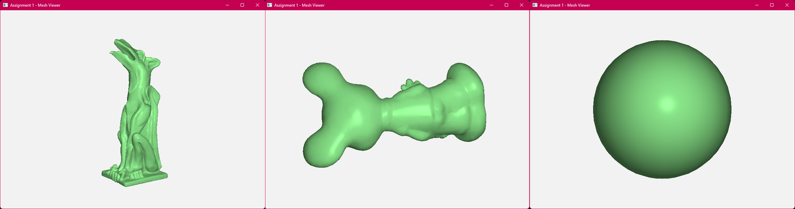
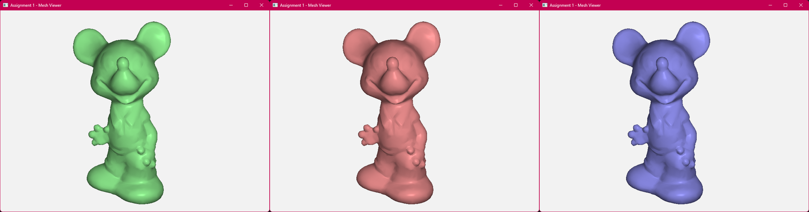
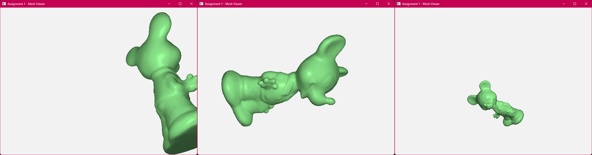

# 50.017 Graphics and Visualization

Assignment 1 – OpenGL Mesh Viewer

1005966 - Seah Ying Xiang

## Task 1: Mesh Loading


Figure 1: (Left to right) garg.obj, mickey.obj, sphere.obj models displayed.

First part is to load the .obj file and read its contents. This is done using `ifstream`.

```c++
// Mesh Loading
//       1) store vertices and normals in verList with order (v.x, v.y, v.z, n.x, n.y, n.z)
//       2) store vertex indices of each triangle in triList
int LoadInput(vector<float> &verList, vector<unsigned> &triList)
{
    // Data location
    string dataPath = "data/mickey.obj";

    // Check obj file
    ifstream file(dataPath);
    if (!file.is_open())
    {
        cout << "Error: cannot open file" << endl;
        return -1;
    }
```

A couple intermediate variables are created to hold the read values from the .obj file, such as vertices, normals, and indices.

The while loop will iterate through each line, wherin `istringstream` is used to parse each value in the line. The first value parsed is recognized as the type of value that the line represents. Each value read from the faces is just pushed into the indices vector.

```c++

    // Read obj file
    vector<glm::vec3> vertices;
    vector<glm::vec3> normals;
    vector<unsigned int> indices;
    string line;
    // iterate through each line in the file
    while (getline (file, line))
    {
        // iterate through each value in a line
        istringstream iss(line);

        // First check line type
        string type;
        iss >> type;
        if (type == "v")
        {
            glm::vec3 vertex;
            iss >> vertex.x >> vertex.y >> vertex.z;
            vertices.push_back(vertex);
        }
        else if (type == "vn")
        {
            glm::vec3 normal;
            iss >> normal.x >> normal.y >> normal.z;
            normals.push_back(normal);
        }
        else if (type == "f")
        {
            // For faces we need a separate line stream to separate the '/'
            for (int i = 0; i < 3; i++)
            {
                string face_vertex;
                iss >> face_vertex; // will produce $v_i/$v_t/$v_n, which needs to be separated
                istringstream face_vertex_stream(face_vertex);
                getline(face_vertex_stream, face_vertex, '/');
                indices.push_back(stoi(face_vertex) - 1); // index of obj starts from 1
                getline(face_vertex_stream, face_vertex, '/');
                indices.push_back(stoi(face_vertex)); // who cares lol (texture coordinates)
                getline(face_vertex_stream, face_vertex, '/');
                indices.push_back(stoi(face_vertex) - 1); // index of obj starts from 1
            }
        }
    }
```

Some debug messages are included.

```c++
    // For debug, print sizes of vertices and face set
    cout << "Total Vertex Count: " << vertices.size() << endl;
    cout << "Total Normal Count: " << normals.size() << endl;
    cout << "Total Face Count: " << indices.size() / 9 << endl;
```

After parsing the file and reading its values, next is to store the values read into the desired format of a verList (vertex and normal list) and triList (face sets). The verList will be first resized to fit all vertices.

The outer loop will cycle through each line read from the "faces" data from the .obj file, which details which normal indices correspond to which vertex indices, as well as which vertex indices make up a face.

The inner loop cycles through each set of vertex_idx/texture_coord/normal_idx data on a single line.

```c++
    // Store vertices and normals and faces
    // 
    // First resize the verList vector to fit all the vertices and normals
    // 
    // Since the list of vertices and normals don't correspond to each other,
    // we will fill the normals in as we iterate through the face set
    // and to do that, we first resize the verList to be able to fit everything
    verList.resize(vertices.size() * 3 * 2); // v.x, v.y, v.z, vn.x, vn.y, vn.z (6 total values for each vertex + normal)
    // Iterate through face set
    for (int i = 0; i < indices.size() / 9; i++) // 3 * 3 = 9 values total in a face set
    {
        for (int k = 0; k < 3; k++) {
            int offset = i * 9 + k * 3;
            glm::vec3 vertex = vertices[indices[offset]]; // first value is the vertex index
            glm::vec3 normal = normals[indices[offset + 2]]; // last value is the normal index
            triList.push_back(indices[offset]); // push the vertex index, of course
            
            int verList_offset = indices[offset] * 6;
            verList[verList_offset + 0] = vertex.x;
            verList[verList_offset + 1] = vertex.y;
            verList[verList_offset + 2] = vertex.z;
            verList[verList_offset + 3] = normal.x;
            verList[verList_offset + 4] = normal.y;
            verList[verList_offset + 5] = normal.z;
        }
    }

    return 0;
}
```

## Task 2: Mesh Colouring


Figure 2: (Left to right) Red, green, and blue colours displayed on mickey.obj.

Increments colorID by 1 on button press, and wraps back to 0 using a modulo function if colorID exceeds the colorTable size.

```c++
// Mesh Coloring
void SetMeshColor(int &colorID)
{
    colorID = (colorID + 1) % colorTable->length();
}
```

## Task 3: Mesh Transformation


Figure 3: (Left to right) Transform, rotate, and scale transformations displayed on mickey.obj.

Rotation is applied via the final form of Rodrigues' Rotation Formula which is extended to homogeneous coordinates.

```c++
// Mesh Transformation (Rotation)
void RotateModel(float angle, glm::vec3 axis)
{
    float c = cos(-angle), s = sin(-angle), c1 = 1 - c;
    float x = axis.x, y = axis.y, z = axis.z;
    glm::mat4 rotMat = glm::mat4(
        x*x*c1 + c, x*y*c1 - z*s, x*z*c1 + y*s, 0,
        y*x*c1 + z*s, y*y*c1 + c, y*z*c1 - x*s, 0,
        x*z*c1 - y*s, y*z*c1 + x*s, z*z*c1 + c, 0,
        0,0,0,1.0f
    );
    modelMatrix *= rotMat;
}
```

The translate and scale model functions are implemented using the built-in methods by OpenGL for translation and scaling.

```c++
// Mesh Transformation (Translation)
void TranslateModel(glm::vec3 transVec)
{
    modelMatrix = glm::translate(modelMatrix, transVec);
}

// Mesh Transformation (Scaling)
void ScaleModel(float scale)
{
    modelMatrix = glm::scale(modelMatrix, glm::vec3(scale));
}
```
