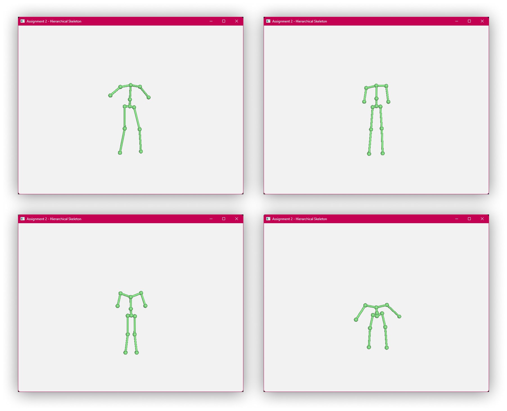

# 50.017 Graphics and Visualization

Assignment 2 – Hierarchical Skeleton

1005966 - Seah Ying Xiang

## Task 1: Load Skeleton File

> Spooky spooky skeletons


> _Figure 1: _(left to right, top to bottom)_ Model1.skel, Model2.skel, Model3.skel, Model4.skel_

The skeleton file is read using `ifstream`, and each row of values is extracted using the extraction operator `>>` which reads each value delimited by whitespace.

Initially, the while loop is used in this fashion `while (skelFile.peek() != EOF)` but that caused an issue where the final line of data is read twice (aka duplicated values) if there is one or more empty line at the end of the file. The current solution fixes this problem.

```c++
// Load the skeleton from file here, create hierarchy of joints
//       (i.e., set values for m_rootJoint and m_joints)
void SkeletalModel::loadSkeleton( const char* filename )
{
    ifstream skelFile(filename);
    float tx, ty, tz;
    int parentId;

    while (skelFile >> tx >> ty >> tz >> parentId) {
        cout << tx << " " << ty << " " << tz << " " << parentId << endl;

        Joint* joint = new Joint;
        m_joints.push_back(joint);

        glm::mat4 transform = glm::translate(glm::mat4(1.0f), glm::vec3(tx, ty, tz));

        joint->transform = transform;
        if (parentId == -1)
        {
            m_rootJoint = joint;
            continue;
        }
        m_joints[parentId]->children.push_back(joint);
    }
}
```

## Task 2: Draw Skeleton

### 2.1 Joints

Push the local joint transformation matrix onto the matrix stack, then push the transformation matrix with respect to the root joint onto the jointMatList. Pop the matrix stack after traversing through all the children.

```c++
// Recursive helper function to traverse the joint hierarchy for computing transformations of the joints
void SkeletalModel::computeJointTransforms(Joint* joint, MatrixStack matrixStack)
{
    matrixStack.push(joint->transform);

    // Transpose cuz the main function transposes the transformation matrices for some unknown reason
    jointMatList.push_back(glm::transpose(matrixStack.top()));
    
    for (unsigned int i = 0; i < joint->children.size(); i++)
        computeJointTransforms(joint->children[i], matrixStack);

    matrixStack.pop();
}
```

As for the transpose function in the `jointMatList.push_back` function: there was a bug where despite all the correct calculations and debugging, the joints all appeared in the same location in the final program and exhibit bizarre behaviour when moving the camera around.


> _Figure 3: Broken render of joints and bones. This shit's spooky, yo. It's not halloween yet_

Turns out, for some reason in **line 475**, **480**, and **493** of **main.cpp**, in the main render loop where the joints and bones are being drawn, the resulting joint transformation matrices were being transposed before being drawn.

```c++
// Line 475 in main.cpp (main render loop, before drawing joints and bones)
glm::mat4 modelCenterMat = glm::transpose( myModel.jointMatList[rootJointIndex] );
// Line 480 in main.cpp (when drawing joints)
glm::mat4 jointLocaMat = glm::transpose(myModel.jointMatList[i]);
// Line 493 in main.cpp (when drawing bones)
glm::mat4 boneLocaMat = glm::transpose(myModel.boneMatList[i]);
```

Thus, the solution was simple, to negate the transposition by transposing before pushing into the stack; voila, the joints and bones appear where they are supposed to be.


> _Figure 2: Literally balls_

### 2.2: Bones

Each bone is a transformed cylinder that is drawn from the parent joint to the child joint.

The cylinder transformed in the following order:

1. **Translated** such that its base is at origin (z + 0.5), then
2. **scaled** to be thinner (x \* 0.01, y \* 0.01) and as long as the distance between the joints (z \* dist), then
3. **rotated** to the direction of the joints, and finally
4. **translated** to the position of the parent joint.

Rotation is calculated using the angle-axis method (Rodrigues' Rotation). The axis is calculated using a cross-product between the from-vector to the to-vector. The from vector in this case is the lengthwise orientation of the cylinder, which is (0, 0, 1). The to-vector would be the normalized translation vector of the child joint transform. The angle is calculated using the arccosine of the dot product between the 2 vectors.

```c++
// Recursive helper function to traverse the joint hierarchy for computing transformations of the bones
void SkeletalModel::computeBoneTransforms(Joint* joint, MatrixStack matrixStack)
{
    matrixStack.push(joint->transform);

    for (unsigned int i = 0; i < joint->children.size(); i++)
    {
        Joint* childJoint = joint->children[i];

        // Get distance between current joint and child joint
        float dist = glm::length(glm::vec3(childJoint->transform[3]));

        // Translate by z by 0.5 units (height/2) so the cylider so the pivot is at origin
        glm::mat4 translatePivot = glm::translate(glm::mat4(1.0f), glm::vec3(0, 0, 0.5f));

        // Scale the cylinder so it's not so phat, and its height by the dist
        glm::mat4 scale = glm::scale(glm::mat4(1.0f), glm::vec3(0.01f, 0.01f, dist));

        //// Rotate the cylinder to face the child joint
        glm::vec3 from = glm::vec3(0, 0, 1.0f);
        glm::vec3 to = glm::normalize(glm::vec3(childJoint->transform[3]));
        glm::vec3 axis = glm::normalize(glm::cross(from, to));
        float angle = acos(glm::dot(from, to));
        glm::mat4 rotate = glm::rotate(glm::mat4(1.0f), angle, axis);

        // First translate pivot, then scale, then rotate, then translate to joint position
        glm::mat4 transform = matrixStack.top() * rotate * scale * translatePivot;

        // Transpose cuz the main function transposes the transformation matrices for some unknown reason
        boneMatList.push_back(glm::transpose(transform));
        computeBoneTransforms(childJoint, matrixStack);
    }

    matrixStack.pop();
}
```

The final transformation is calculated in the order above, with the matrix stack transformation applied last. The result is pushed into the bone matrix list, transposed, as per the issue mentioned above.


> _Figure 4: What happens if you don't drink enough calcium._

## Task 3: Change Pose of Skeleton

The angle for the pose change is converted to radians, then converted into transformation matrices for each axis rotation. This rotation matrix is then applied to the joint transform matrix. `computeTransforms()` is called at the end to update the joint and bone matrix lists.

```c++
// Set the rotation part of the joint's transformation matrix based on the passed in Euler angles.
void SkeletalModel::setJointTransform(int jointIndex, float angleX, float angleY, float angleZ)
{
    // Convert from degrees to radians
    angleX *= M_PI / 180.0f;
    angleY *= M_PI / 180.0f;
    angleZ *= M_PI / 180.0f;
    glm::mat4 rotX = glm::rotate(glm::mat4(1.0f), angleX, glm::vec3(1.0f, 0, 0));
    glm::mat4 rotY = glm::rotate(glm::mat4(1.0f), angleY, glm::vec3(0, 1.0f, 0));
    glm::mat4 rotZ = glm::rotate(glm::mat4(1.0f), angleZ, glm::vec3(1, 0, 1.0f));
    // Apply rotation
    m_joints[jointIndex]->transform = m_joints[jointIndex]->transform * rotZ * rotY * rotX;
    computeTransforms();
}
```

ISSUE: Even with the above working code, when attempting to update the angle would result in buggy transformations such as this:


> _Figure 5: Changing pose of bone 3 (left/right thigh) causes discombobulation_

The poses of the child joints and bones appeared to be rotated about the world origin?

After much debugging the issue was found to be within the `MatrixStack.cpp`, with the order of how the matrix transformations are applied when they are pushed onto the stack. The code below shows a snippet of the `MatrixStack` class, with both the original line that causes the bug and the fix.

```c++
void MatrixStack::push( const glm::mat4& m )
{
    // Push m onto the stack.
    // Your stack should have OpenGL semantics:
    // the new top should be the old top multiplied by m
    
    //Doing multiplication
    glm::mat4 top = m * m_matrices.back(); // original ! USING THIS CAUSES BUGGY POSES
    glm::mat4 top = m_matrices.back() * m; // fixed
    m_matrices.push_back(top);
}
```

After the fix, changing of the pose works as intended.


>_Figure 6: Default Model1.skel pose (left), changed Model1.skel pose doing a split (right)_
