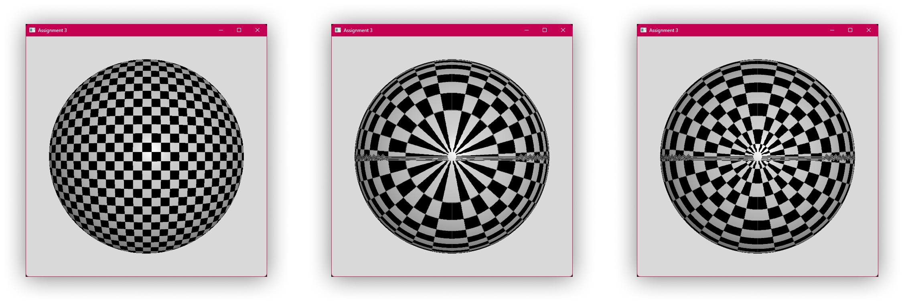
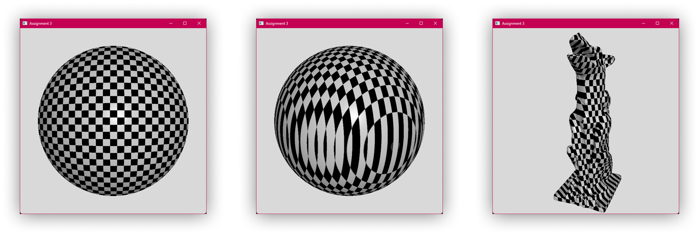
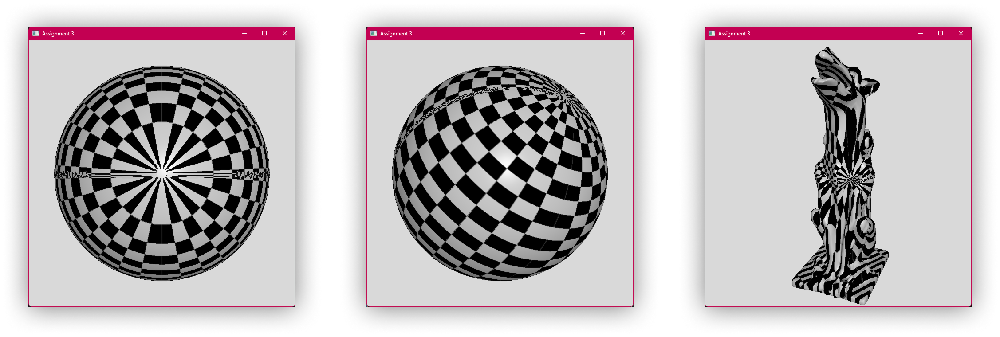
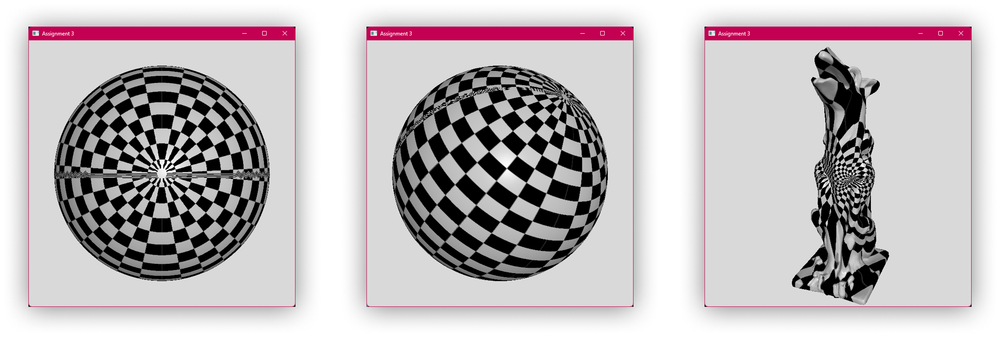
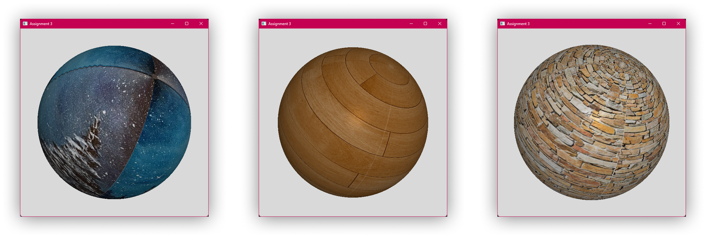

# 50.017 Graphics and Visualization

Assignment 3 – Texture Mapping

1005966 - Seah Ying Xiang


> _Figure 1: (Left to right) Planar, cylindrical, and sphererical parameterisation displayed using a texture grid on a sphere model._

## Task 1: Planar Parameterisation


> _Figure 2: Planar parameterisation. (Left to right) Frontal view, side view, and a gargoyle model._

UV coordinates are calculated by projecting local coordinates of vertices onto the XY-plane, normalizing the coordinates against the bounding box, then mapping the XY coordinates onto the UV map.

```c++
//// Plane mapping
void calcPlaneMapping(void)
{
    for (unsigned int i = 0; i < myObject.vertices.size(); i++)
    {
        Vertex& v = myObject.vertices[i];
        v.t[0] = (v.v[0] - myObject.bBox.minP[0]) / myObject.bBox.vSize[0];
        v.t[1] = (v.v[1] - myObject.bBox.minP[1]) / myObject.bBox.vSize[1];
    }
}
```

## Task 2: Cylindrical Parameterisation


>_Figure 3: Cylindrical parameterisation. (Left to right) Frontal view, side view, and a gargoyle model._

Polar coordinates for the model is calculated and the UV is mapped to the polar angle (θ) and normalized z-value of the vertex coordinates respectively.

```c++
//// Cylindrical mapping
void calcCylindricalMapping(void)
{
    for (unsigned int i = 0; i < myObject.vertices.size(); i++)
    {
        Vertex& v = myObject.vertices[i];
        glm::vec3 v_norm = glm::normalize(glm::vec3(v.v[0], v.v[1], v.v[2]));
        float angle = glm::atan(v_norm[0] / v_norm[1]);
        v.t[0] = angle / (2 * PI);
        v.t[1] = (v.v[2] - myObject.bBox.minP[2]) / myObject.bBox.vSize[2];
    }
}
```

## Task 3: Spherical Parameterisation


>_Figure 4: Spherical parameterisation. (Left to right) Frontal view, side view, and a gargoyle model._

Polar coordinates for the model is calculated and the UV is mapped to the polar angle (θ) and azimuthal angle (φ) respectively. The azimuthal angle is then divided by π rather than 2π as the texture is mapped to 180 degrees of the object. If the texture coordinate exceeds the bounds (>1) then it will be reversed, such that the orientation of the texture on all sides of the object is the right way up.

```c++
//// Sphere mapping
void calcSphereMapping(void)
{
    for (unsigned int i = 0; i < myObject.vertices.size(); i++)
    {
        Vertex& v = myObject.vertices[i];
        glm::vec3 v_norm = glm::normalize(glm::vec3(v.v[0], v.v[1], v.v[2]));
        float angle_long = glm::atan(v_norm[0] / v_norm[1]);
        float angle_lat = glm::acos(v_norm[2]);
        v.t[0] = angle_long / (2 * PI);
        v.t[1] = angle_lat / PI;
        if (v.t[1] > 1.0f)
            v.t[1] = 2.0f - v.t[1];
    }
}
```

Spherical parameterisation with different textures:


>_Figure 4: Respective texture files were used: (Left to right) texture_scene.png, texture_wood.png, texture_stone.png._
