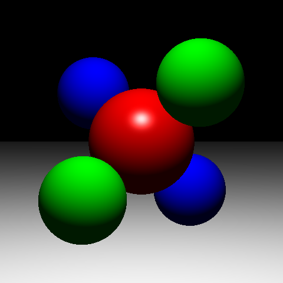
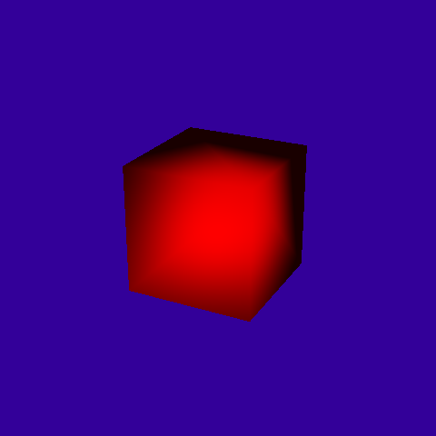
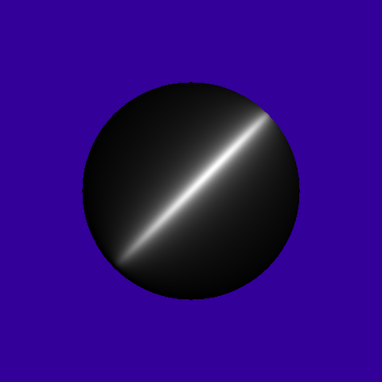
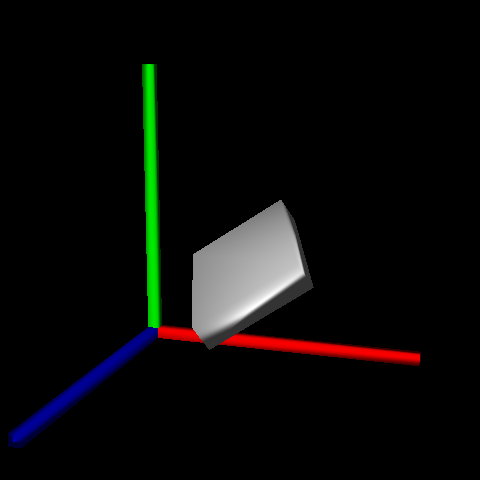
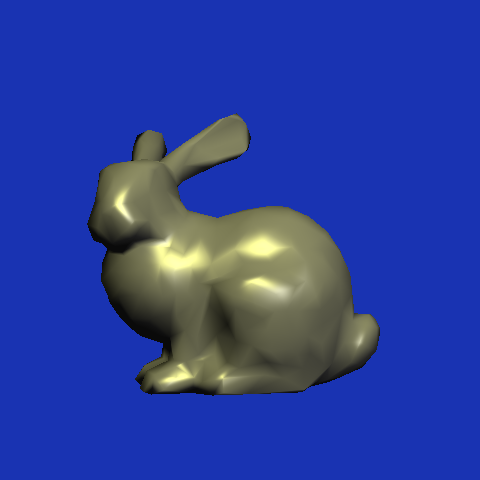
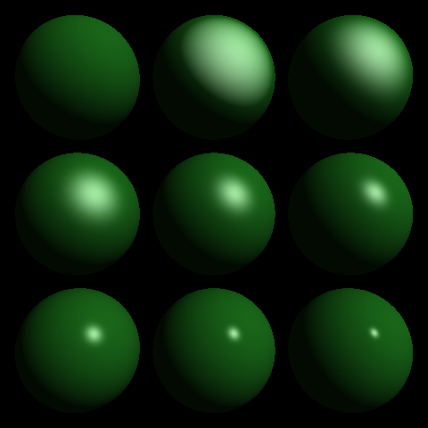

# 50.017 Graphics and Visualization

Assignment 4 – Ray Tracing

1005966 - Seah Ying Xiang







> _Figure 1-6: Scene 1-6 480x480 renders._

## Task 1.1: Ray-Object Intersections (Sphere)

Various checks against ray direction and sphere origin are performed, and final intersection check is calculated using the quadratic equation.

```c++
/// Ray-sphere intersection test.
virtual bool intersect( const Ray& r , Hit& h , float tmin)
{
    // Sphere-to-ray-origin vector
    vec3 rel_sphere_center = r.getOrigin() - this->center;

    // Dot of sphere-to-ray-origin vector and ray direction
    // Negative if ray is pointing in the general direction of the sphere
    float b = dot(rel_sphere_center, r.getDirection());

    // Square of distance between sphere center and ray origin subtracted by square of radius
    // Positive if ray origin is outside of sphere
    float c = dot(rel_sphere_center, rel_sphere_center) - this->radius * this->radius;

    // No intersection if ray origin is outside sphere and pointing away from sphere
    if (c > 0.0f && b > 0.0f) return false;

    // Calculate discriminant to determine whether an intersection will happen
    float discr = b * b - c;
    if (discr < 0.0f) return false; // Ray misses sphere

    // Compute smallest t value of intersection
    float t = -b - sqrtf(discr);

    // Check against t min
    if (t < tmin || t > h.getT()) return false;

    // Closest intersection found, updating hit parameters
    // Normal is direction of hit point from sphere center
    vec3 normal = normalize(r.pointAtParameter(t) - this->center);
    h.set(t, this->material, normal);
    return true;
}
```

## Task 1.2: Ray-Object Intersections (Plane)

Direction of ray is checked against the plane. Initially the plane was rendered on the opposite coordinates, but was fixed as the negative `d` value was accounted for.

```c++
/// Ray-plane intersection test.
virtual bool intersect( const Ray& r , Hit& h , float tmin)
{   
    float denom = dot(this->normal, r.getDirection());
    // If the ray is very close to parallel with the plane, assume no intersection
    // also assume backface rendering is true
    if (denom < 1e-6f && denom > -1e-6f) return false;

    // Vector from plane origin to ray origin
    vec3 r_p = -d * this->normal - r.getOrigin();
    float t = dot(r_p, this->normal) / denom;
    
    // Check for tmin
    if (t < tmin || t > h.getT()) return false;

    // Closest intersection found, update hit params
    h.set(t, this->material, this->normal);
    return true;
}
```

## Task 2: Lighting Computations

The phong lighting formulas are quite straightforward, except for one caveat.

On the first iteration of the lighting model, the models appeared dark and barely lit compared to the reference images. However, this bug was caused by the lack of normalization of the normal vectors.

Afterwards, after ensuring all directional vectors are normalized, the final output matches the reference images.

```c++
/// Compute diffuse and specular components of Phong lighting 
vec3 Shade( const Ray& ray, const Hit& hit, const vec3& dirToLight, const vec3& lightColor ) 
{
    vec3 n = normalize(hit.getNormal());
    vec3 l = normalize(dirToLight);
    vec3 r = 2.0f * n * dot(n, l) - l;

    float diffuse_dp = dot(n, l);
    diffuse_dp = diffuse_dp > 0 ? diffuse_dp : 0;
    float specular_dp = dot(r, -normalize(ray.getDirection()));
    specular_dp = specular_dp > 0 ? powf(specular_dp, this->shininess) : 0;

    vec3 I = lightColor * (this->diffuseColor * diffuse_dp + this->specularColor * specular_dp);
    return I;
}
```
